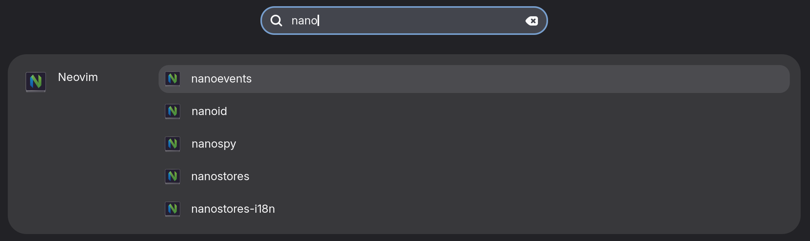

# CSV Search Provider

CSV Search Provider durchsucht CSV-Dateien aus dem Downloads-Ordner und zeigt die Ergebnisse in der GNOME Shell Suche an.

## Installation

Die Extension lädt automatisch alle `.csv`-Dateien aus `~/Downloads`.

## CSV-Format

Die CSV-Datei muss mit Semikolon (`;`) getrennt sein und hat **4 Spalten**:

```
Name;Beschreibung;Wert;Icon
```

- **Spalte 1 (Name)**: Der Anzeigetitel des Eintrags (wird in der Suche angezeigt)
- **Spalte 2 (Beschreibung)**: Zusätzliche Beschreibung (wird unter dem Titel angezeigt)
- **Spalte 3 (Wert)**: URL, Dateipfad oder Text, der geöffnet/kopiert werden soll
- **Spalte 4 (Icon)**: Icon-Dateiname aus dem `icons`-Ordner (z.B. `web.svg`, `file.svg`, `copy.svg`, `exec.svg`). Die Kategorie wird automatisch aus dem Icon-Namen extrahiert.

**Kommentare**: Zeilen, die mit `#` beginnen, werden ignoriert.

### Beispiel

Lege eine Datei `data.csv` in `~/Downloads` an:

```csv
Google;Suche im Web;https://www.google.de;web.svg
Config Datei;Öffnet eine Konfigurationsdatei;/home/user/.config/app/config;file.svg
Token;Kopiert einen Token in die Zwischenablage;ABC-123-XYZ;copy.svg
# Das ist ein Kommentar
Backup Script;Startet ein Backup Script;/home/user/bin/backup.sh;exec.svg
```

### Verhalten

Die Extension erkennt automatisch anhand des Icons, was mit dem Wert passieren soll:
- **web.svg**: URL wird im Browser geöffnet
- **file.svg**: Datei wird mit der Standard-App geöffnet
- **copy.svg**: Text wird in die Zwischenablage kopiert
- **exec.svg**: Kommando wird ausgeführt

### Logs anzeigen

Um zu sehen, welche CSV-Dateien geladen wurden:

```bash
journalctl -f -o cat /usr/bin/gnome-shell | grep CSV-Search-Provider
```


@workspace Ich habe eine voll funktionsfähge Gnome CSV Search extension aus github geklont und hier hineingelegt. Im Moment sucht die Extension nach gespeicherten Remmina-Verbindungen. 
Baue die App wie folgt um:

Im Moment heißt die App CSV Search Provider. Das soll konsquent umbenannt werden nach csv-search-provider. 

Das soll die neue App tun:
Es sollen alle txt und csv-Dateien im Ordner /home/stefan/.csv-search-provider Zeile für Zeile indiziert werden. Jede Zeile in jeder gefundenen Datei hat eine oder zwei oder drei Spalten. Beispiel "Meine_Termine.txt":

31.12.2026, 20:00 Silvester|https://my-calender-online.de|icon.png
01.01.2027, New Year|https://my-calender-online.de|icon2.png

Wenn der Anwender nun in der Gnome-Shell-Suche Silvester eingibt, dann soll als Suchergebnis Spalte 1 "31.12.2026, 20:00 Silvester" angezeigt werden. Wenn der Anwender das Suchergebnis klickt, soll der URL in der zweiten Spalte geöffnet werden.

In Spalte 3 steht optional ein Icon, was angezeigt werden soll.
Wenn Spalte3 kein Icon hat, soll das Standard-Icon im root-Pfad (icon.png) zu jedem Treffer angezeigt werden. Die Icons liegen ebenfalls in .csv-search-provider. Wenn ei icon fehlt, nimm ebenfalls das Standardicon aus root.

Ich habe bereits ein csv-search-provider.sh, das installiert und deinstalliert und debuggt. Passe das auch entsprechend an, falls nötig.





## Install

[](https://extensions.gnome.org/extension/8227/csv-search-provider/)

1. Öffne [Search CSV] auf der GNOME Shell Extensions Seite.
2. Click slider to install extension.
3. Reload page.
4. Open extension settings.
5. Setze den Such-Ordner und die App-ID (siehe Anleitung unten).

[Search CSV]: https://extensions.gnome.org/extension/8227/csv-search-provider/

## App ID

This extension needs App ID of IDE. App ID is filename of `.desktop` files in:
- `/usr/share/applications/`
- `/var/lib/flatpak/exports/share/applications/`
- `~/.local/share/applications/`

You may use [Pins](https://flathub.org/apps/io.github.fabrialberio.pinapp) app to create app for custom script.
